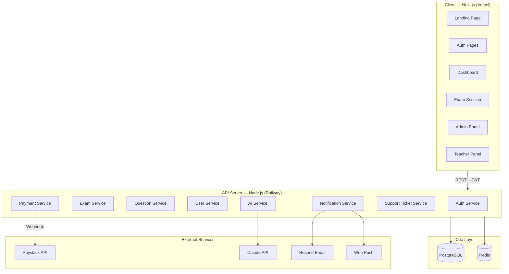

# PRD.md — Xavier 300
## Tech Certification Mock Exam Platform
**Version:** 1.0 | **Status:** Approved for Build | **Market:** Nigeria

---

## 1. Product Overview

### What It Is
Xavier 300 is a web-based tech certification mock exam platform built for the Nigerian market. It simulates real certification exams across 9 tech domains with AI-generated questions, timed sessions, anti-cheat enforcement, and personalised AI-powered study recommendations.

### Who It's For
- Students transitioning between tech skills
- Professionals seeking certification for career advancement or travel/visa purposes
- Fresh graduates and undergraduates entering tech
- Professionals taught by teachers/trainers who use Xavier 300 as their practice tool

### Why It Matters
Foreign certification practice platforms cost $30–50/month. Xavier 300 costs ₦5,000/month — localised, affordable, and teacher-curated. It is the only Nigerian-market certification practice platform with AI question generation, anti-cheat simulation, and gamified weekly leaderboards.

### Revenue Model
| Plan | Price | Duration |
|---|---|---|
| Free Trial | ₦0 | 7 days |
| Monthly | ₦5,000 | 30 days |
| Annual | ₦50,000 | 365 days (save ₦10,000) |

---

## 2. Tech Domains & Certifications

| Domain | Priority | Certifications Covered |
|---|---|---|
| Data Analysis | 🔴 High | Microsoft Power BI, Google Data Studio, Excel Analytics |
| Data Science | 🔴 High | IBM Data Science, Google ML, Python for DS |
| Cybersecurity | 🔴 High | CompTIA Security+, CEH, CISSP |
| Microsoft Azure | 🟡 Medium | AZ-900, AZ-104, AZ-204 |
| Microsoft Excel | 🟡 Medium | MOS Excel Associate, MOS Excel Expert |
| DevOps | 🟡 Medium | AWS DevOps, Azure DevOps, Docker/K8s |
| Full Stack Web Dev | 🟡 Medium | Meta Front-End, AWS Developer, Node.js |
| Project Management | 🟢 Standard | PMP, CAPM, PMI-ACP |
| Microsoft Power BI | 🟢 Standard | PL-300 (Power BI Data Analyst) |

---

## 3. Core User Stories & Acceptance Criteria

### US-01: Landing & Discovery
**As a** visitor, **I want to** understand what Xavier 300 offers and browse available certifications **so that** I can decide to sign up.

**Acceptance Criteria:**
- Given I visit `/`, I see a hero section with platform tagline and CTA to start free trial
- When I scroll, I see all 9 tech domains displayed as glass cards with certification counts
- When I click a domain card, I see the list of certifications under that domain
- Then I see a CTA to sign up before accessing any exam

---

### US-02: Authentication — Sign Up
**As a** new user, **I want to** create an account **so that** I can access the platform.

**Acceptance Criteria:**
- Given I am on `/signup`, I can enter: Full Name, Email, Password, Phone Number, State (Nigeria), Occupation, Years of Experience
- When I submit, I receive a 6-digit OTP email verification
- Given I verify my email, my account is created with `FREE_TRIAL` status and trial start timestamp
- Then I am redirected to `/dashboard`
- The system must collect: name, email, phone, state, occupation, experience level for admin analytics

---

### US-03: Authentication — Login
**As a** returning user, **I want to** log in securely **so that** I can resume my practice.

**Acceptance Criteria:**
- Given I am on `/login`, I can enter email + password
- When credentials are correct, I receive a JWT access token (15min) + refresh token (7 days)
- Given my subscription has expired, I am redirected to `/pricing` with a lock message
- Given my email is unverified, I see a prompt to resend OTP

---

### US-04: Subscription & Payment
**As a** user whose free trial has ended, **I want to** pay via bank transfer or card **so that** I can continue using the platform.

**Acceptance Criteria:**
- Given I am on `/pricing`, I see Monthly (₦5,000) and Annual (₦50,000) plans
- When I select a plan, I am directed to Paystack checkout
- Given I pay via bank transfer, I see account details and a "I have paid" confirmation button that triggers payment verification
- When Paystack webhook confirms payment, my account is upgraded to `SUBSCRIBED` status immediately
- Given payment fails or is unconfirmed after 24h, my account remains locked
- On Day 8 of trial with no payment: hard lock — redirect to `/pricing` on every protected route

---

### US-05: Exam Selection
**As a** subscribed user, **I want to** select a certification and start a mock exam **so that** I can practice.

**Acceptance Criteria:**
- Given I am on `/courses`, I see all 9 domains
- When I select a domain, I see all certifications with question count and estimated difficulty
- When I select a certification, I see the exam lobby with: exam rules, time limit (30 min), question count, attempt count today (max 3)
- Given I have used 3 attempts today, I see a lock message: "Daily limit reached. Come back tomorrow."
- When I click "Start Exam", the system enters fullscreen mode and begins the session

---

### US-06: Exam Session — Core
**As a** user in an exam, **I want to** answer questions in a timed, secure environment **so that** I can simulate the real exam experience.

**Acceptance Criteria:**
- Given the exam starts, questions are shuffled from the question bank (randomised pool of 40 from 200+)
- Answer options are also randomised per question
- Timer counts down from 30:00 — displayed in mono font, top right
- When timer hits 5:00, timer pulses red as a warning
- When timer reaches 0:00, the exam is auto-submitted
- I can flag questions for review and navigate back to them
- A progress bar shows questions answered vs total
- The exam interface prevents: right-click, copy/paste, text selection

---

### US-07: Anti-Cheat System
**As** the platform, **I want to** detect and respond to cheating attempts **so that** the exam remains fair and question integrity is preserved.

**Acceptance Criteria:**
- Given the exam is active and the user switches browser tab: exam pauses + warning modal shown (first offence)
- Given the user switches tab a second time: exam is auto-submitted with a "Integrity Violation" flag
- Given the user presses Escape or F11 to exit fullscreen: warning modal shown, exam paused
- Given the user exits fullscreen twice: auto-submit
- Right-click is disabled on the exam page
- Text selection / copy is disabled via CSS + JS
- Screenshot detection attempted via `visibilitychange` API event
- Each exam session is watermarked with user ID in a subtle overlay

---

### US-08: Network Interruption Handling
**As** a user with unstable internet, **I want** the exam to pause gracefully **so that** I am not penalised for network issues.

**Acceptance Criteria:**
- Given internet disconnects during an exam: timer pauses, a "Connection Lost — Exam Paused" overlay appears
- The user's answers so far are saved to localStorage every 30 seconds
- When connection restores: a "Reconnected — Resume Exam?" modal appears
- Given the user resumes: timer continues from where it paused, answers are restored
- Given connection is not restored within 10 minutes: exam is auto-submitted with saved answers

---

### US-09: Exam Results & AI Recommendations
**As a** user who has completed an exam, **I want to** see my score, speed, and personalised recommendations **so that** I know what to study next.

**Acceptance Criteria:**
- Given the exam is submitted, I see: percentage score, questions correct/total, time taken, speed (questions per minute)
- A radial progress ring animates to my score
- Topics are grouped: strong areas (≥70%) and weak areas (<70%)
- For each weak area, the AI generates 2–3 specific text-based study recommendations (book chapters, documentation links, topic names)
- I can see which specific questions I got wrong and the correct answers
- A CTA offers: "Retake Exam" or "Try Another Certification"
- My attempt is recorded (attempt 1 of 3 for today)

---

### US-10: Weekly Leaderboard
**As a** user, **I want to** see how I rank against other users weekly **so that** I am motivated to practice more.

**Acceptance Criteria:**
- Given I am on `/leaderboard`, I see the top 20 users ranked by average score this week
- My position is always visible (even if outside top 20, shown at bottom)
- Rankings show: rank, anonymised name (first name + last initial), average score, exams taken
- Leaderboard resets every Monday at 00:00 WAT
- A countdown shows time until next reset
- Previous week's top 3 are shown with trophy badges

---

### US-11: Daily Practice Notifications
**As** a user, **I want** to receive daily reminders to practice **so that** I build consistent study habits.

**Acceptance Criteria:**
- Given I have enabled notifications (opt-in on signup), I receive a push notification daily at my chosen time (default: 9:00 AM WAT)
- Notification content: "You haven't practiced today, [Name]. Your streak is at risk! 🔥"
- In-app notification badge shown in nav when I haven't practiced today
- Email fallback if push notification is declined

---

### US-12: Teacher — Add Questions
**As a** teacher, **I want to** add exam questions to the platform **so that** students get curated, high-quality content.

**Acceptance Criteria:**
- Given I am logged in as a Teacher, I see "Add Questions" in my teacher dashboard
- I can select: Domain → Certification → Difficulty (Easy / Medium / Hard)
- I enter: Question text, 4 answer options, correct answer, explanation
- When I submit, the question enters `PENDING_REVIEW` status
- I cannot publish questions myself — Super Admin approval required
- I can see the status of all my submitted questions (Pending / Approved / Rejected)

---

### US-13: Admin — Question Management
**As** Super Admin, **I want to** manage all question content **so that** only quality questions reach students.

**Acceptance Criteria:**
- Given I am on `/admin/questions`, I see all questions filterable by domain, status, source (AI/Teacher/Admin)
- I can approve, reject, or edit any question
- Rejected questions show a rejection note visible to the teacher
- I can trigger AI question generation per domain (specifying count: 10/25/50)
- AI-generated questions enter `PENDING_REVIEW` by default
- I can bulk approve AI questions after review

---

### US-14: Admin — User Management
**As** Super Admin, **I want to** view and manage all user accounts **so that** I can monitor platform health and support users.

**Acceptance Criteria:**
- Given I am on `/admin/users`, I see all users with: name, email, subscription status, join date, exams taken, last active
- I can filter by: subscription status, domain interest, registration date
- I can manually extend or revoke subscriptions
- I can export user data as CSV
- I can view anonymised aggregate stats: total users, active subscribers, top domains, daily active users

---

### US-15: Support Ticket System
**As a** user, **I want to** raise a support ticket **so that** I can get help with payment, access, or exam issues.

**Acceptance Criteria:**
- Given I am on `/support/new`, I can select issue type: Payment, Access, Exam Bug, Account, Other
- I enter a subject and description (max 1000 chars)
- I receive an email confirmation with ticket ID
- Given I am on `/support`, I see all my tickets with status: Open / In Progress / Resolved
- Given I am an Admin on `/admin/tickets`, I see all tickets, can respond, and update status
- User receives email notification when admin responds

---

## 4. Tech Stack

### Frontend
| Technology | Choice | Justification |
|---|---|---|
| Framework | Next.js 14 (App Router) | SSR for landing/SEO, client components for exam |
| Language | TypeScript (strict) | Type safety across the full stack |
| Styling | Tailwind CSS + CSS Variables | Design token system, dark mode via `data-theme` |
| UI Components | shadcn/ui (customised) | Headless, matches our design system |
| Fonts | Cormorant Garamond + DM Sans + JetBrains Mono | Per DESIGN.md |
| State | Zustand | Lightweight, exam session state management |
| Data Fetching | TanStack Query (React Query) | Caching, background sync, optimistic updates |
| Forms | React Hook Form + Zod | Validation, type-safe schemas |
| Animations | Framer Motion | Page transitions, score reveal, card hovers |
| Icons | Lucide React | Consistent, clean icon set |
| Charts | Recharts | Score analytics, progress charts |

### Backend
| Technology | Choice | Justification |
|---|---|---|
| Runtime | Node.js 20 | |
| Framework | Express.js (or Fastify) | REST API — simple, performant |
| ORM | Prisma | Type-safe DB queries, migrations |
| Auth | JWT (access 15min + refresh 7d) + bcrypt | Custom auth for full control |
| Email | Resend (or Nodemailer + SMTP) | OTP verification, notifications |
| Push Notifications | Web Push API + VAPID | Daily practice reminders |
| AI | Anthropic Claude API (`claude-sonnet-4-20250514`) | Question generation + recommendations |
| Payment | Paystack Node SDK | Bank transfer + card + USSD |
| Job Queue | Bull (Redis-backed) | Daily leaderboard reset, notification jobs |
| File Upload | Multer + Cloudinary | Admin avatars, question images (future) |

### Database
| Technology | Choice |
|---|---|
| Primary DB | PostgreSQL (via Railway) |
| Cache | Redis (Bull queues + session cache) |
| ORM | Prisma |

### Infrastructure
| Service | Provider |
|---|---|
| Frontend Hosting | Vercel |
| Backend Hosting | Railway |
| Database | Railway (PostgreSQL) |
| Redis | Railway (Redis) |
| Email | Resend |
| Payments | Paystack |
| AI | Anthropic API |
| Domain | Custom (`.com.ng` or `.ng`) |

---

## 5. System Architecture



---

## 6. Database Schema

```prisma
// schema.prisma

model User {
  id                String         @id @default(cuid())
  email             String         @unique
  passwordHash      String
  fullName          String
  phone             String
  state             String
  occupation        String
  yearsExperience   Int
  role              Role           @default(STUDENT)
  emailVerified     Boolean        @default(false)
  verificationOTP   String?
  otpExpiresAt      DateTime?
  subscriptionStatus SubStatus     @default(FREE_TRIAL)
  trialStartedAt    DateTime       @default(now())
  subscriptionEndsAt DateTime?
  notificationsEnabled Boolean     @default(true)
  notificationTime  String         @default("09:00")
  theme             String         @default("light")
  createdAt         DateTime       @default(now())
  updatedAt         DateTime       @updatedAt

  examAttempts      ExamAttempt[]
  tickets           SupportTicket[]
  questionContributions Question[]
  payments          Payment[]
  weeklyScore       WeeklyScore?
}

enum Role {
  STUDENT
  TEACHER
  ADMIN
}

enum SubStatus {
  FREE_TRIAL
  SUBSCRIBED
  EXPIRED
  CANCELLED
}

model Domain {
  id            String          @id @default(cuid())
  name          String
  slug          String          @unique
  description   String
  iconMark      String          // SVG path data
  priority      Int             @default(0)
  certifications Certification[]
}

model Certification {
  id            String     @id @default(cuid())
  domainId      String
  domain        Domain     @relation(fields: [domainId], references: [id])
  name          String
  slug          String     @unique
  description   String
  examDuration  Int        @default(30)  // minutes
  questionCount Int        @default(40)  // per session
  difficulty    Difficulty @default(MEDIUM)
  questions     Question[]
  examAttempts  ExamAttempt[]
}

enum Difficulty {
  EASY
  MEDIUM
  HARD
}

model Question {
  id              String       @id @default(cuid())
  certificationId String
  certification   Certification @relation(fields: [certificationId], references: [id])
  text            String
  options         Json         // { A: "", B: "", C: "", D: "" }
  correctAnswer   String       // "A" | "B" | "C" | "D"
  explanation     String
  difficulty      Difficulty   @default(MEDIUM)
  topic           String       // sub-topic tag for weak area analysis
  source          QuestionSource @default(AI)
  status          QuestionStatus @default(PENDING_REVIEW)
  contributedById String?
  contributedBy   User?        @relation(fields: [contributedById], references: [id])
  createdAt       DateTime     @default(now())
}

enum QuestionSource {
  AI
  TEACHER
  ADMIN
}

enum QuestionStatus {
  PENDING_REVIEW
  APPROVED
  REJECTED
}

model ExamAttempt {
  id              String       @id @default(cuid())
  userId          String
  user            User         @relation(fields: [userId], references: [id])
  certificationId String
  certification   Certification @relation(fields: [certificationId], references: [id])
  startedAt       DateTime     @default(now())
  completedAt     DateTime?
  timeTaken       Int?         // seconds
  score           Float?       // percentage 0-100
  totalQuestions  Int
  correctAnswers  Int?
  status          AttemptStatus @default(IN_PROGRESS)
  integrityFlag   Boolean      @default(false)
  answers         Json         // { questionId: selectedAnswer }
  weakTopics      Json?        // [ { topic, score } ]
  aiRecommendations Json?      // [ { topic, recommendation } ]
  attemptNumber   Int          // 1, 2, or 3 for that day
  createdAt       DateTime     @default(now())
}

enum AttemptStatus {
  IN_PROGRESS
  COMPLETED
  AUTO_SUBMITTED
  INTEGRITY_VIOLATION
}

model Payment {
  id              String        @id @default(cuid())
  userId          String
  user            User          @relation(fields: [userId], references: [id])
  paystackRef     String        @unique
  amount          Int           // in kobo
  plan            PlanType
  status          PaymentStatus @default(PENDING)
  verifiedAt      DateTime?
  createdAt       DateTime      @default(now())
}

enum PlanType {
  MONTHLY
  ANNUAL
}

enum PaymentStatus {
  PENDING
  SUCCESS
  FAILED
}

model WeeklyScore {
  id          String   @id @default(cuid())
  userId      String   @unique
  user        User     @relation(fields: [userId], references: [id])
  weekStart   DateTime
  totalScore  Float    @default(0)
  examsCount  Int      @default(0)
  avgScore    Float    @default(0)
  updatedAt   DateTime @updatedAt
}

model SupportTicket {
  id          String       @id @default(cuid())
  userId      String
  user        User         @relation(fields: [userId], references: [id])
  type        TicketType
  subject     String
  description String
  status      TicketStatus @default(OPEN)
  adminNote   String?
  createdAt   DateTime     @default(now())
  updatedAt   DateTime     @updatedAt
}

enum TicketType {
  PAYMENT
  ACCESS
  EXAM_BUG
  ACCOUNT
  OTHER
}

enum TicketStatus {
  OPEN
  IN_PROGRESS
  RESOLVED
}
```

---

## 7. API Design

### Auth Endpoints
```
POST   /api/auth/signup              Create account + send OTP
POST   /api/auth/verify-email        Verify OTP
POST   /api/auth/login               Login → JWT tokens
POST   /api/auth/refresh             Refresh access token
POST   /api/auth/logout              Invalidate refresh token
POST   /api/auth/resend-otp          Resend verification OTP
POST   /api/auth/forgot-password     Send reset email
POST   /api/auth/reset-password      Reset with token
```

### User Endpoints
```
GET    /api/users/me                 Get current user profile
PATCH  /api/users/me                 Update profile / preferences
GET    /api/users/me/stats           Exam history and analytics
```

### Exam Endpoints
```
GET    /api/domains                  List all domains
GET    /api/domains/:slug            Domain + certifications
GET    /api/certifications/:slug     Certification details
POST   /api/exams/start              Start exam session → returns shuffled questions
POST   /api/exams/:id/submit         Submit exam answers
GET    /api/exams/:id/results        Get results + AI recommendations
GET    /api/exams/attempts/today     Count today's attempts for a cert
```

### Leaderboard Endpoints
```
GET    /api/leaderboard/weekly       Top 20 + current user rank
GET    /api/leaderboard/previous     Last week's top 3
```

### Payment Endpoints
```
POST   /api/payments/initiate        Create Paystack transaction
POST   /api/payments/verify          Manual bank transfer verification
POST   /api/payments/webhook         Paystack webhook handler
GET    /api/payments/history         User payment history
```

### Question Endpoints (Teacher)
```
POST   /api/questions                Submit new question (Teacher/Admin)
GET    /api/questions/my             Teacher's submitted questions + status
```

### Admin Endpoints
```
GET    /api/admin/questions          All questions with filters
PATCH  /api/admin/questions/:id      Approve/reject/edit question
POST   /api/admin/questions/generate Trigger AI generation
GET    /api/admin/users              All users with filters
PATCH  /api/admin/users/:id          Update subscription/role
GET    /api/admin/stats              Platform analytics
GET    /api/admin/tickets            All support tickets
PATCH  /api/admin/tickets/:id        Respond to ticket / update status
```

### Support Endpoints
```
POST   /api/support/tickets          Create ticket
GET    /api/support/tickets          My tickets
GET    /api/support/tickets/:id      Ticket detail + messages
```

---

## 8. AI Integration — Question Generation

### Prompt Template (Claude API)
```
System: You are an expert certification exam question writer for {certificationName}.
Generate {count} multiple-choice questions about the topic: {topic}.

Rules:
- Each question must have exactly 4 options (A, B, C, D)
- Only one correct answer
- Difficulty: {difficulty}
- Include a brief explanation for the correct answer
- Questions must reflect real {certificationName} exam style
- Return ONLY valid JSON, no markdown

JSON format:
{
  "questions": [
    {
      "text": "Question text here",
      "options": { "A": "...", "B": "...", "C": "...", "D": "..." },
      "correctAnswer": "A",
      "explanation": "Why A is correct...",
      "topic": "sub-topic name",
      "difficulty": "MEDIUM"
    }
  ]
}
```

### AI Recommendation Prompt
```
System: You are a study advisor for tech certification students.

A student just completed a {certificationName} mock exam.
Weak areas (scored below 70%): {weakTopics}

For each weak area, recommend 1 specific study resource:
- Exact Microsoft Learn module name, or
- Specific documentation section, or
- Named book chapter

Return as JSON array. Be specific, not generic.
```

---

## 9. Non-Functional Requirements

### Performance
- Landing page Lighthouse score ≥ 90
- Exam page initial load < 2 seconds
- API response time < 300ms (p95)
- Question bank query with randomisation < 100ms

### Security
- JWT tokens — httpOnly cookies for refresh token
- Rate limiting: `/api/auth/*` — 5 requests/minute
- Input sanitisation on all endpoints (express-validator)
- SQL injection prevention via Prisma parameterised queries
- CORS restricted to frontend domain
- Paystack webhook signature verification
- Exam session tokens to prevent direct answer submission

### Scalability
- Stateless API — horizontal scaling ready
- Redis for session state (not in-memory)
- Question pool size minimum: 200 per certification at launch
- Database indexes on: userId, certificationId, weekStart, status fields

### Accessibility
- WCAG 2.1 AA compliant
- Keyboard navigation on all interactive elements
- Screen reader support (aria-labels on exam options)
- Minimum contrast ratio 4.5:1 (both themes)

### Browser Support
- Chrome 110+ (primary)
- Firefox 110+
- Safari 16+
- Edge 110+
- Mobile Chrome + Safari (iOS 15+)

---

## 10. Out of Scope (v1.0)

- Native mobile app (iOS/Android) — web-first only
- Video content or course material hosted on platform
- Live class or cohort features
- AI chatbot / tutor chat
- Multi-language support (English only at launch)
- Social login (Google, LinkedIn) — email only at launch
- Certificate generation after mock exam
- Teacher earnings / revenue sharing model
- Offline mode
- Question image uploads (text-only questions at launch)

---

## 11. Launch Checklist

- [ ] All 9 domains seeded with minimum 200 approved questions each
- [ ] Paystack integration tested with live keys
- [ ] Email OTP verification tested
- [ ] Anti-cheat system tested across Chrome, Firefox, Safari
- [ ] Dark/light mode tested on all pages
- [ ] Mobile responsive tested on common Nigerian devices
- [ ] Admin dashboard functional
- [ ] Support ticket system tested end-to-end
- [ ] Leaderboard reset job scheduled
- [ ] Daily notification job scheduled
- [ ] SSL certificate active
- [ ] Environment variables documented
- [ ] Error monitoring (Sentry) configured

---

*PRD v1.0 — Xavier 300 | Ready for Prompt Pack Generation*
